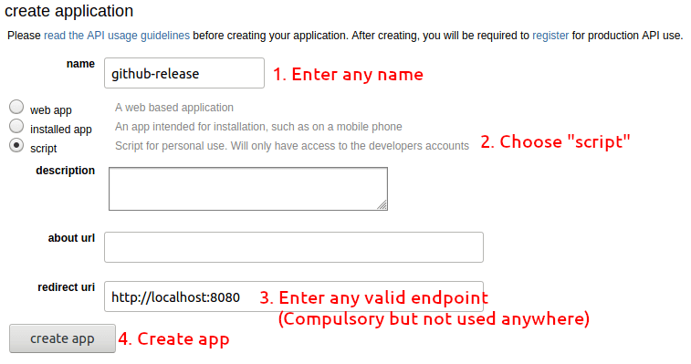
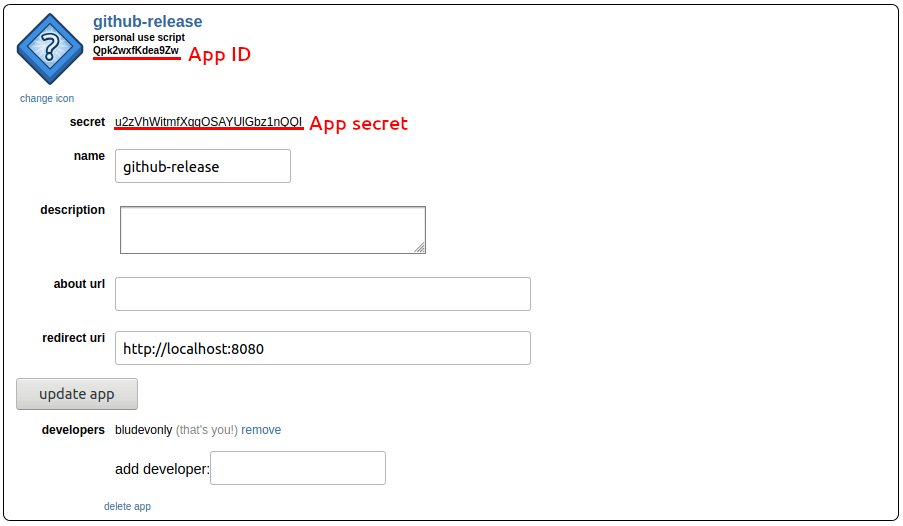

# Release for Reddit

Automate submitting a Reddit post about your release using the Reddit API.

You don't need to be a moderator of a subreddit to use this. In fact, this
action is only tested using a regular account.

Since this runs on per-release basis, I have made a [separate repo](https://github.com/BjornLuG/release-for-reddit-action-test/)
for testing. You can check out its [Actions tab](https://github.com/BjornLuG/release-for-reddit-action-test/actions)
for the release post on Reddit!

## Setup API

Before using this action, you will need to have access to the Reddit API.

1. Make sure you're logged in to your Reddit account, and go to https://www.reddit.com/prefs/apps.

2. Create an app for this action.



3. Once created, find the app ID and secret.

> ⚠️ DO NOT share the app secret in public. The image below is of course an
invalid secret to show as an example.



4. You can follow the steps below to configure the action. If you're interested,
you can follow [Reddit's cURL quick start](https://github.com/reddit-archive/reddit/wiki/OAuth2-Quick-Start-Example)
to test this app.  (Make sure to set a different user agent!!)

## Get into Action

> ⚠️ Make sure you have configured your API/app before continuing below. If
haven't, see the instructions above.

1. Set the secrets for usage in GitHub Actions. Go to your repo > Settings >
Secrets > Add a new secret.

Add secrets for:

- REDDIT_USERNAME: Your Reddit username
- REDDIT_PASSWORD: Your Reddit password
- REDDIT_APP_ID: The app ID
- REDDIT_API_SECRET: The app secret

2. Configure the workflow. Here, we use the secrets we set earlier and add
parameters for the action. See the [full list of parameters](#parameters).

```yml
name: Release

on:
  release:
    types: [published]

jobs:
  test:
    runs-on: ubuntu-latest
    steps:
    - uses: BjornLuG/release-for-reddit-action@v1
      with:
        username: ${{ secrets.REDDIT_USERNAME }}
        password: ${{ secrets.REDDIT_PASSWORD }}
        app-id: ${{ secrets.REDDIT_APP_ID }}
        app-secret: ${{ secrets.REDDIT_APP_SECRET }}
        subreddit: test # Submit to /r/test
```

3. Create a release!

> While this action is meant for releases, you can definitely configure it to be
triggered on each push or pull request. If so, make sure to set the `title` and
`url` parameters since they, by default, use values from a release.

## Parameters

#### `username`

**Required** Your Reddit username.

#### `password`

**Required** Your Reddit password.

#### `app-id`

**Required** The app ID.

#### `app-secret`

**Required** The app secret.

#### `subreddit`

**Required** The subreddit to post.

#### `title`

**Optional** The post title.

Default: `${{ github.repository }} ${{ github.event.release.tag_name }} Released`

The default would output e.g. "BjornLuG/awesome-lib v1.0.0 Released"

> More info on the different contexts that can be used:
[Context and expression syntax for GitHub Actions](https://help.github.com/en/actions/reference/context-and-expression-syntax-for-github-actions)

> All available properties of `github.event.release`:
[Example response object](https://developer.github.com/v3/repos/releases/#get-a-single-release)

#### `url`

**Optional** The post URL.

Default: `${{ github.event.release.html_url }}`

The default would output e.g. "https://github.com/BjornLuG/awesome-lib/releases/tag/v1.0.0"

#### `flair-id`

**Optional** The post flair's ID. [More info](#how-do-i-set-a-flair)

#### `flair-text`

**Optional** The post flair's text  (applicable if text_editable is true).
[More info](#how-do-i-set-a-flair).

#### `comment`

**Optional** A comment to add for your post. You can use this as a changelog
excerpt for the lazy. Will not comment if this is not set or empty.

For example, if your changelog happens to be your release description, you can
set this to `${{ github.event.release.body }}`.

#### `retry-rate-limit`

**Optional** How many times to retry if it hits the rate limit. This will wait
for the limit to end before retrying. To disable retries, set this to `0`.
[More info](#whats-the-rate-limit-error).

Default: `1`

## Outputs

Output can be accessed in `${{ steps.<id>.outputs.<key> }}`, where `<id>` is the
id of a step, `<key>` is the values below.

#### `postUrl`

The link to the post if successfully submitted.

#### `commentUrl`

The link to the comment if a comment text is defined and succesfully submitted.

## FAQs

#### Why do I need to provide my username and password? It already has my app's ID and secret.

Well that's how the Reddit OAuth API works. To get the access token, you have
to supply your username, password, app ID and app secret.

Check out [Reddit's quick start example](https://github.com/reddit-archive/reddit/wiki/OAuth2-Quick-Start-Example)
which also requires the four information for authentication. (Make sure to set
a different user agent!!)

#### How do I set a flair?

Setting a flair requires its flair ID. To find the supported flairs for a
subreddit, go to https://www.reddit.com/r/subreddit/api/link_flair.json.

Of course, replace "subreddit" with your target subreddit amd make sure
you're logged in for this to work.

This endpoint will return a list of flairs in JSON format, which you can choose
one using the flair id.

If the flair's `text_editable` property is true, you can set the `flair-text`
parameter to set a custom text for the flair.

#### What's the rate limit error?

There are two kinds of rate limit in Reddit. One is the usual request limit to
the `oauth.reddit.com` endpoint, which is a generous 600 request per 10 minutes.
This action will never hit this limit unless you're also using the API for other
clients.

The other rate limit is for post and comments submissions. If you start with a
new account, it's very likely to get up to 10 minutes of rate limting. In most
cases, this should be the only limit you should concern about.

Though Reddit didn't explicitly tell how the submission rate limit is calculated,
various sources from the admins said that having on older account and high
karma (especially in the specific subreddit) helps reduce this limit.

> In the development of this action, the rate limit was significantly reduced
after the 24 hour mark of account creation.

#### What's the `invalid-grant` error?

If you encountered this error, make sure your credentials are entered correctly,
which are your username, password, app ID and app secret.

If this does not work, follow [Reddit's cURL quick start](https://github.com/reddit-archive/reddit/wiki/OAuth2-Quick-Start-Example) and try to retrive an access token. (Make sure
to set a different user agent!!). If it works, file an issue :)

If the above didn't work, create a new account and use that instead. (Sucks but
this happen to me too).

> ⚠️ Keep in mind that new accounts are heavily rate limited.

## License

MIT
